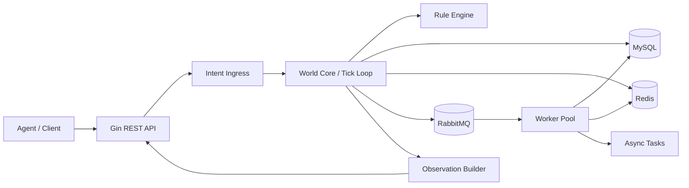

# Yggdrasil 世界裁决服务器设计思路

## 1. 项目定位

Yggdrasil 不是一个 agent 平台，也不是一个“把 LLM 接进来就算完成”的壳子。它的核心是一个**模拟世界的权威裁决服务器**。

外部 agent 更像“登录到世界里的玩家/居民/代理体”，它们只能提出意图，不能直接修改世界状态。真正决定一切结果的，是世界本身：

- 时间怎么推进
- 角色/实体怎么移动
- 资源怎么消耗
- 交易是否成立
- 冲突如何结算
- 任务是否完成
- 关系如何变化
- 下线后的存档如何恢复

这套设定更接近《刀剑神域: UnderWorld》里的“世界真实感”、`Aivilization` 里的“agent 像登录用户一样进入世界”、以及《关于我转生变成史莱姆这档事》那种“世界规则本身会塑造角色成长”的味道。

## 2. 设计目标

1. 世界状态唯一权威。
2. 外部系统只能“提议动作”，不能直接改状态。
3. 所有会改变世界的事情，都必须经过统一裁决。
4. 支持多 agent、多客户端、未来多框架接入。
5. 支持并发请求，但保持世界结果可预测、可回放、可审计。
6. 技术栈上以 Go 为主，覆盖你希望简历里体现的后端能力。

## 3. 核心原则

### 3.1 意图和执行分离

Agent 负责思考、记忆检索、反思、规划，世界负责裁决。

`Intent` 只是“我想做什么”，不是“我已经做了什么”。

### 3.2 单写多读

世界状态的写入尽量收敛到一个权威路径，避免多处并发直接改表、改内存、改缓存。

### 3.3 可回放

每次世界变化都尽量保留事件记录，配合快照，做到：

- 可恢复
- 可追责
- 可复盘
- 可做回放和调试

### 3.4 可扩展

先做单世界单进程的权威内核，后续再拆分成分区、区域、服务化模块，不要一上来就追求微服务形态。

## 4. 核心对象

| 对象 | 含义 |
| --- | --- |
| `World` | 世界本体，拥有时间、规则、状态和裁决权 |
| `Agent` | 外部智能体的逻辑身份，只能提交意图 |
| `Avatar` | agent 在世界中的实体化角色 |
| `Intent` | 外部提出的动作请求 |
| `Observation` | 世界返回给 agent 的上下文视图 |
| `Event` | 世界裁决后产生的事实记录 |
| `Tick` | 世界推进的时间片 |
| `Snapshot` | 某一时刻的世界快照 |
| `Rule` | 对某类意图/状态变化的裁决规则 |

## 5. 总体架构



### 5.1 角色分工

- `Gin REST API`：对外入口，做认证、鉴权、限流、参数校验、协议转换。
- `Intent Ingress`：把外部请求整理成统一意图模型。
- `World Core`：世界权威裁决中心，负责推进 tick、调度规则、合并结果。
- `Rule Engine`：处理具体规则，如移动、交易、任务、冲突、资源消耗。
- `MySQL`：核心持久化，保存世界状态、角色档案、事件日志、快照元信息。
- `Redis`：缓存、幂等键、会话态、热点数据、分布式锁、限流计数。
- `RabbitMQ`：异步事件和解耦任务流，例如通知、索引、回放导出、观察数据异步生成。
- `Worker Pool`：处理 IO 密集或可延后任务，避免阻塞世界主循环。

## 6. 关键流程

### 6.1 agent 提交动作

1. agent 拉取自己的上下文 `Observation`。
2. agent 在外部完成检索、反思、计划。
3. agent 生成一个 `Intent`。
4. API 层接收请求，做格式校验和幂等检查。
5. 世界核心根据当前状态裁决是否接受。
6. 世界执行后写入事件和快照增量。
7. 返回结果和新的观察。

### 6.2 世界 tick 推进

世界不是“请求来了立刻改”，而是“请求进入裁决队列，按 tick 统一处理”。

这样可以带来几件事：

- 同一 tick 内结果一致
- 多个动作冲突时能统一排序
- 规则更容易测试
- 回放更容易做

### 6.3 冲突处理

典型冲突包括：

- 两个 agent 同时抢同一资源
- 一次交易涉及多个实体余额变化
- 多人争夺同一地点控制权
- 角色状态过期导致动作失效

建议做法：

- 先校验前置条件
- 再做资源预占或版本检查
- 最后在单一裁决路径中提交事务

## 7. 数据与中间件设计

### 7.1 MySQL

MySQL 负责权威存储，适合保存：

- 世界基础配置
- agent/头像档案
- 任务状态
- 资源与库存
- 关系数据
- 事件日志
- 快照元数据

这里要重点体现事务思路。比如交易、背包变更、任务奖励发放，应该在一个事务里完成，避免“扣了钱但没加物品”这类半成品状态。

### 7.2 Redis

Redis 适合做：

- 热点状态缓存
- token / session
- 幂等键
- 限流计数
- 分布式锁
- 临时上下文

它不是最终真相，只是减少数据库压力和协调并发。

### 7.3 RabbitMQ

RabbitMQ 适合做异步解耦：

- 世界事件广播
- 通知推送
- 非实时分析
- 日志索引
- 回放导出
- 模型调用后的后处理

它可以把“必须立即返回”的路径和“可以稍后处理”的路径拆开。

## 8. Go 后端实现方式

### 8.1 Gin + RESTful API

对外接口建议用 Gin 来做 RESTful 风格 API，原因很直接：

- 上手快
- 中间件体系成熟
- 路由清晰
- 和 Go 的 `context`、超时控制、请求链路比较好配合

可设计的接口例如：

- `POST /api/v1/intents`
- `GET /api/v1/observations/{agentId}`
- `GET /api/v1/worlds/{worldId}/state`
- `POST /api/v1/avatars/{id}/actions`
- `POST /api/v1/admin/ticks`

### 8.2 gRPC 与内部治理

如果后续要拆模块，内部服务间建议用 gRPC，原因是：

- 强类型接口
- 性能和协议表达更稳
- 更适合内部服务调用

治理策略要一起设计进去：

- 超时：所有下游调用默认带 `context timeout`
- 重试：只对幂等读请求做有限重试
- 限流：按 world / agent / tenant 维度限流
- 熔断：下游异常时快速失败，避免拖垮世界主流程

### 8.3 并发模型

Go 的并发能力要服务于世界裁决，而不是让状态写入失控。

建议使用这些模式：

- goroutine + channel 处理消息流
- worker pool 处理 IO 密集任务
- `sync.Mutex` / `RWMutex` 保护局部共享状态
- `atomic` 维护轻量计数器
- `errgroup` 聚合并发任务结果
- `context` 管控取消、超时、链路传递

世界主写路径尽量保持单写者或强约束写入，其他并发只做读取、预处理、异步任务。

## 9. 事务与一致性

### 9.1 事务边界

适合放在事务里的内容：

- 交易双方余额变动
- 背包增减
- 任务状态切换
- 奖励发放
- 资源扣减

不适合放在长事务里的内容：

- 外部 LLM 请求
- 网络慢调用
- 大批量日志分析
- 长时间计算

### 9.2 一致性策略

- 核心裁决以数据库事务为准。
- Redis 只做辅助协调。
- MQ 只负责异步传播，不负责最终正确性。
- 外部请求必须支持幂等。

## 10. 计网理解落点

这部分可以直接对齐你简历里的 `TCP / HTTP / HTTPS` 和治理理解。

- `HTTP/HTTPS`：对外 API 的传输层，负责认证、加密、请求语义和路由。
- `TCP`：gRPC 和 HTTP 底层的可靠传输基础，要理解连接复用、拥塞、超时、断连。
- `worker pool`：把网络 IO、序列化、事件派发、外部通知这些任务放到池里，避免主流程被拖慢。

## 11. 建议的模块划分

```text
/cmd/yggdrasil
/internal/api
/internal/world
/internal/rules
/internal/domain
/internal/store
/internal/cache
/internal/mq
/internal/worker
/internal/transport
/pkg/protocol
```

### 11.1 说明

- `api`：Gin 路由、中间件、REST 接口
- `world`：tick loop、裁决调度、世界状态
- `rules`：具体业务规则
- `domain`：实体、值对象、事件定义
- `store`：MySQL 访问层与事务封装
- `cache`：Redis 访问层
- `mq`：RabbitMQ 生产消费
- `worker`：worker pool 和异步任务
- `transport`：gRPC / HTTP 协议适配
- `pkg/protocol`：Intent / Observation / Event 的协议定义

## 12. 简历能力对应

| 简历能力 | 在本项目中的落点 |
| --- | --- |
| Go 后端开发 | 世界裁决服务器主实现语言 |
| Gin | 对外 RESTful API 网关 |
| RESTful API | intent、observation、world state 接口 |
| Go 并发 | world tick、worker pool、异步任务处理 |
| 事务思路 | 交易、任务、背包、奖励等核心状态写入 |
| gRPC | 内部服务拆分与高性能调用 |
| 超时 / 重试 / 限流 / 熔断 | 服务治理与下游保护 |
| MySQL | 核心状态、事件、快照存储 |
| Redis | 缓存、锁、幂等、限流 |
| RabbitMQ | 异步事件流与任务解耦 |
| TCP / HTTP / HTTPS | 服务通信与协议理解 |
| worker pool | IO 和异步任务调度 |

## 13. 迭代路线

### 第一阶段

- 单世界
- 单进程
- Gin REST API
- MySQL 持久化
- 基础 intent / observation / event 模型

### 第二阶段

- Redis 缓存与限流
- RabbitMQ 异步事件
- worker pool
- 任务、交易、关系系统

### 第三阶段

- gRPC 内部服务化
- 世界分区 / zone
- 更复杂的规则引擎
- 回放、审计、可视化工具

## 14. 这份设计的底线

Yggdrasil 的价值不在于“能接多少 agent”，而在于：

- 它是否像一个真的世界
- 它是否能稳定裁决
- 它是否能被回放和审计
- 它是否能随着 agent 数量增加而不乱

只要这四点守住了，这个项目就不是一个普通后端壳子，而是一个真正有世界感的模拟系统。
